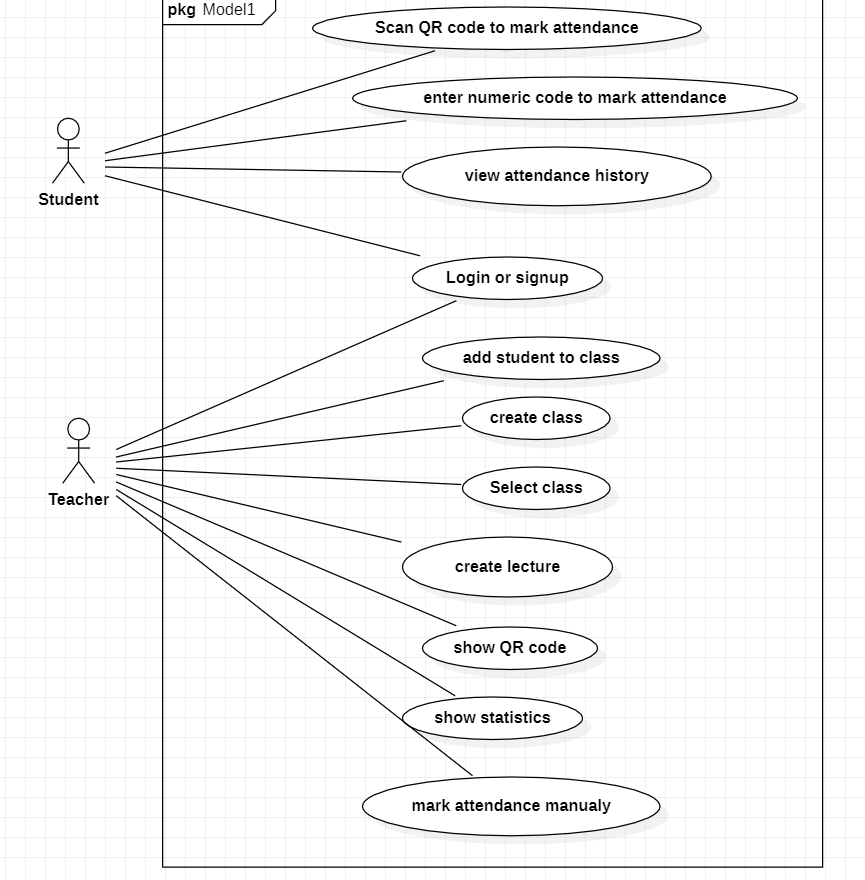
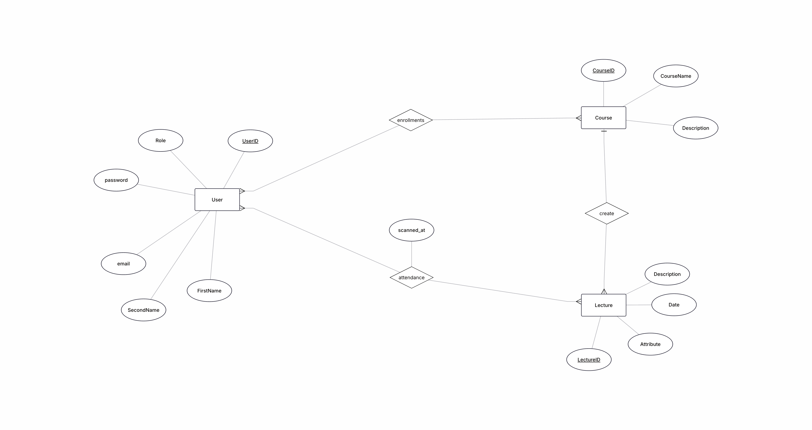
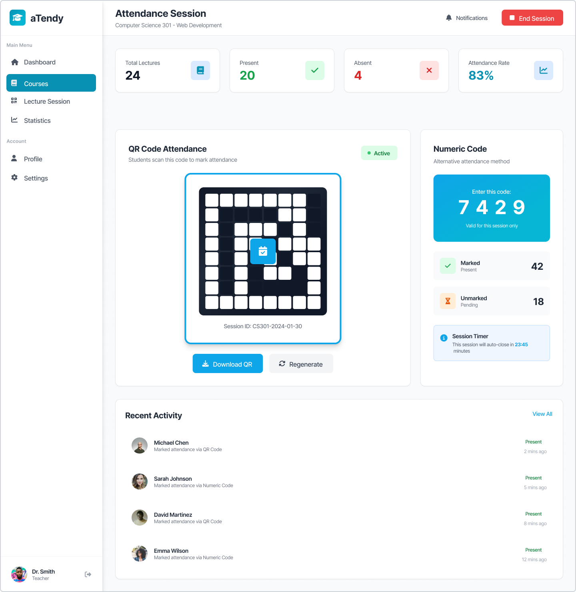
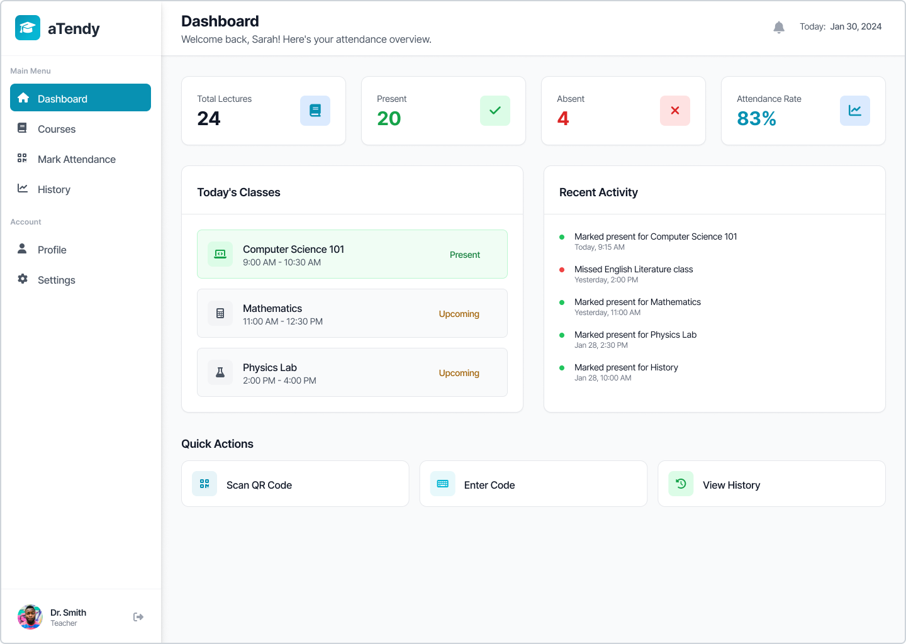
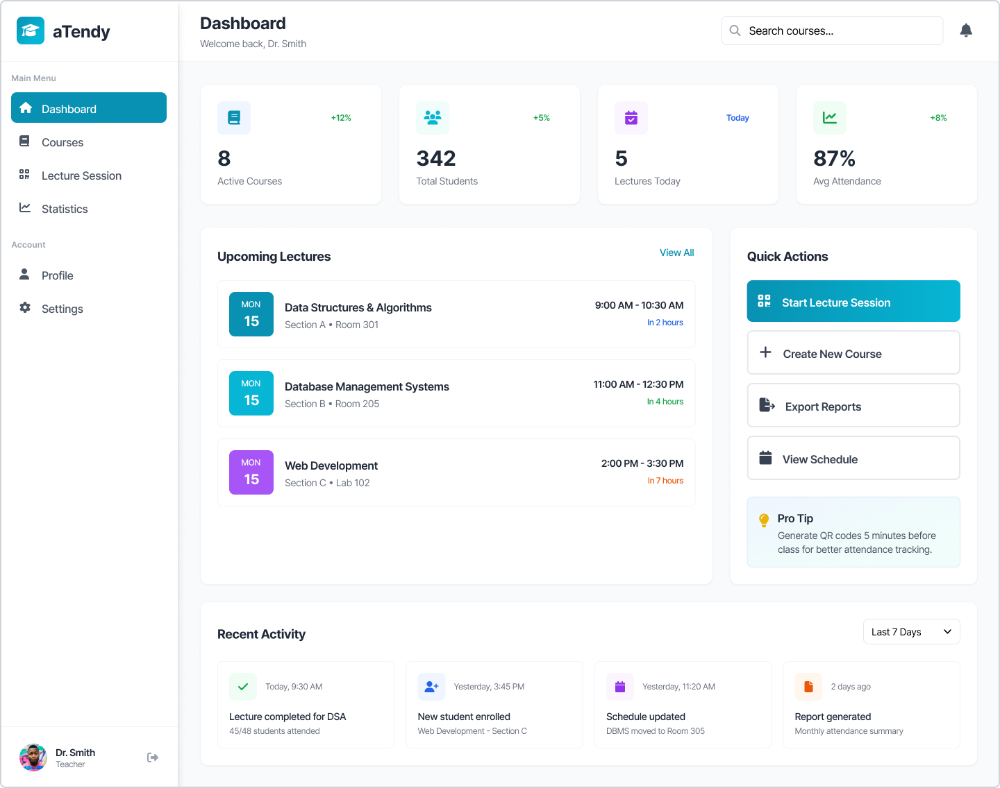

# Attendance System

<p>
  <a href="../../actions/workflows/maven.yml">
    
  </a>
  <a href="https://java.com">
    
  </a>
  <a href="https://spring.io/projects/spring-boot">
    
  </a>
  <a href="https://maven.apache.org/">
    
  </a>
</p>

## Product Vision
We are building an application for teachers to replace their google excel sheet when marking their students attendance.

Our vision is to let the teacher focus more on the lectures and less on marking attendance whenever a new student arrives. Also, we want to distribute responsibilities in the class between students and teachers. This will save time and effort for both sides.

## Problem Statement
Teachers are marking their students attendance using excel sheets and by calling their names one by one, which could be time consuming and the teacher might forget to do it sometimes. We are aiming to fix this by making attendance marking one of the students responsibility by creating an application for the students to mark their attendance at each class, reducing time taken for shouting names one by one as well as marking the students who arrive after the names shouting process.

## Key Features
- Teachers can create a lecture with QR or numeric code.
- Students can scan or write the code to mark their attendance.
- Student and teacher accounts must be created and verified.
- Teachers can view statistics of the lecture such as students attended, time interval, and more.
- GPS verification to ensure students are at the campus when marking attendance.

## Current Status (as of 2026-03-10)

### Critical functionality completed:
- Authentication and authorization.
- Courses management
- Enrollments management
- Lectures management
- Attendance registration and view (teacher side)

### Planned but not yet implemented:
- Student can see own attendance statistics & history
- GPS validation and lecture statistics (for teachers).
- Teacher can manipulate attendance records.

# Technologies used
## Backend
- Java 17
- Spring Boot 4.x
- PostgreSQL 17.x
- Docker
- Docker Compose

## Frontend
- React 19
- Typescript 5.x
- Tailwind CSS 3.x
- Vite 7.x


# Use-case diagram


# ER diagram



# Database Schema
The database schema for the Attendance system is defined in [schema.sql](attendance-backend/src/main/resources/schema.sql).


# Design samples

[Figma link](https://www.figma.com/design/sZLcbQrxw2GWL2JwaMqEaD/Untitled?node-id=3-4&t=LgzHsbRGwN9KeBQI-0)

## Lecture view


## Student dashboard


## Teacher dashboard


---

# Run localy

## 0. Database

```shell
PG_LOCAL_DATA=PATH_TO_DATA_DIR docker compose -f compose.yaml up -d postgres
```

## 1. Backend
Check backend readme for reference

## 2. Frontend
Check frontend readme for reference


---

# Build and run Docker

```shell
cd attendance-frontend
docker build -t attendance-frontend:latest .

cd ../attendance-backend
docker build -t attendance-backend:latest .

cd ..
Windows:
$env:PG_LOCAL_DATA="./attendance-backend/data"; docker compose -f compose.yaml up -d postgres

Linux, Mac:
PG_LOCAL_DATA=/this/is/your/path docker compose -f compose.yaml up -d

```