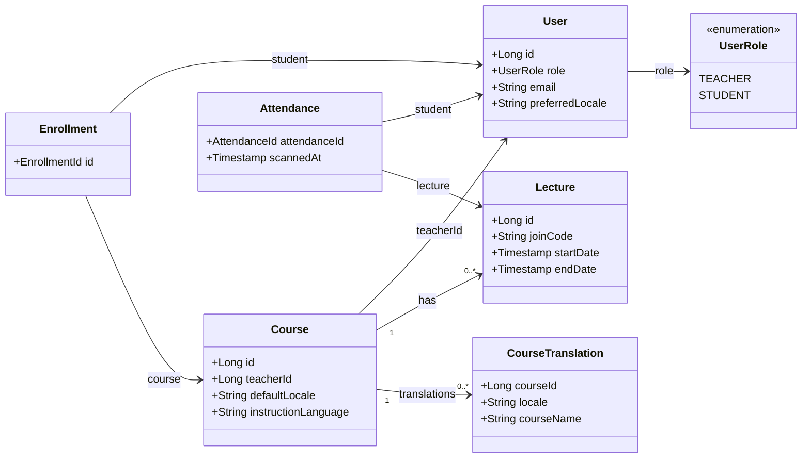
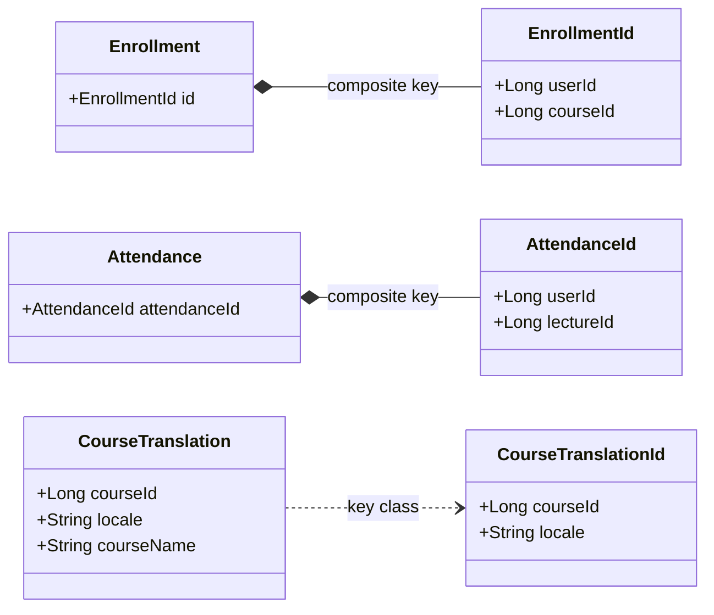
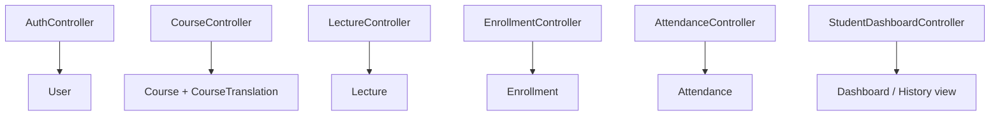

# Class Diagram

Reconstructed from [CLASS_DIAGRAM.pdf](/Users/levkaravanov/Dev/Attendance/docs/diagrams/CLASS_DIAGRAM.pdf) and aligned with the current backend code in [attendance-backend/src/main/java/org/example/attendancebackend](/Users/levkaravanov/Dev/Attendance/attendance-backend/src/main/java/org/example/attendancebackend).

## Core Domain Model

## Persistence Details

## REST Controllers Overview

## Notes

- `Course.courseName` and `Course.description` are resolved localized API values; the persisted localized text lives in `CourseTranslation`.
- Compared to the PDF version, this source includes the newer localization-related model changes: `CourseTranslation`, `CourseTranslationId`, `Course.defaultLocale`, `Course.instructionLanguage`, and `User.preferredLocale`.
- The main diagram intentionally omits some helper classes and less important fields to keep Mermaid readable.
- `StudentDashboardController` works with user, course, lecture, and attendance data, but that dependency fan-out is summarized as `Dashboard / History view` to avoid a tangled graph.
- If you need a single figure for the report, use `Core Domain Model` as the main class diagram and keep the other two blocks as supporting figures.
