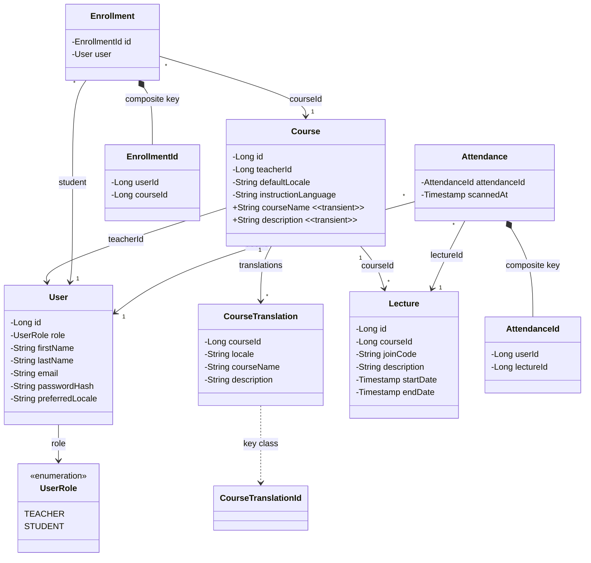

# Class Diagram

Reconstructed from [CLASS_DIAGRAM.pdf](/Users/levkaravanov/Dev/Attendance/docs/diagrams/CLASS_DIAGRAM.pdf) and aligned with the current backend code in [attendance-backend/src/main/java/org/example/attendancebackend](/Users/levkaravanov/Dev/Attendance/attendance-backend/src/main/java/org/example/attendancebackend).

## Domain Model

## REST Controllers

```mermaid
classDiagram
direction TB

class AuthController {
  +signup(SignupRequest) ResponseEntity
  +signin(SigninRequest) ResponseEntity
  +me(HttpServletRequest) ResponseEntity
}

class CourseController {
  +getCourses() ResponseEntity
  +getCourse(Long id) ResponseEntity
  +createCourse(Course) ResponseEntity
  +updateCourse(Course) ResponseEntity
  +deleteCourse(Long id) ResponseEntity
}

class LectureController {
  +getLectures(Long courseId) List
  +getLecture(Long id) Lecture
  +createLecture(Lecture) Lecture
  +updateLecture(Long id, Lecture) Lecture
  +deleteLecture(Long id) void
}

class EnrollmentController {
  +uploadEnrollments(Long courseId, MultipartFile) ResponseEntity
  +getCourseEnrollments(Long courseId) ResponseEntity
  +deleteEnrollments(Long courseId) ResponseEntity
  +updateEnrollments(Long courseId, OneStudentEnrollment) ResponseEntity
  +deleteOneEnrollment(Long courseId, Long userId) ResponseEntity
}

class AttendanceController {
  +MarkAttendance(Map body) Attendance
  +getPresentStudents(Long id) List
}

class StudentDashboardController {
  +getDashboard() StudentDashboardResponse
  +getHistory() StudentHistoryResponse
}

AuthController --> User
CourseController --> Course
CourseController --> CourseTranslation
LectureController --> Lecture
EnrollmentController --> Enrollment
AttendanceController --> Attendance
StudentDashboardController --> Dashboard

class User { }
class Course { }
class CourseTranslation { }
class Lecture { }
class Enrollment { }
class Attendance { }
class Dashboard { }
```

## Notes

- `Course.courseName` and `Course.description` — transient поля, разрешаются через локализацию; персистентный текст хранится в `CourseTranslation`.
- `CourseTranslation` использует `@IdClass(CourseTranslationId)` с составным ключом `(courseId, locale)`.
- `Enrollment` и `Attendance` используют `@EmbeddedId` с составными ключами `EnrollmentId` и `AttendanceId` соответственно.
- `StudentDashboardController` агрегирует данные из нескольких сущностей — зависимости показаны обобщённо как `Dashboard`.
- Сервисы, репозитории, DTO и конфигурация опущены для читаемости.
