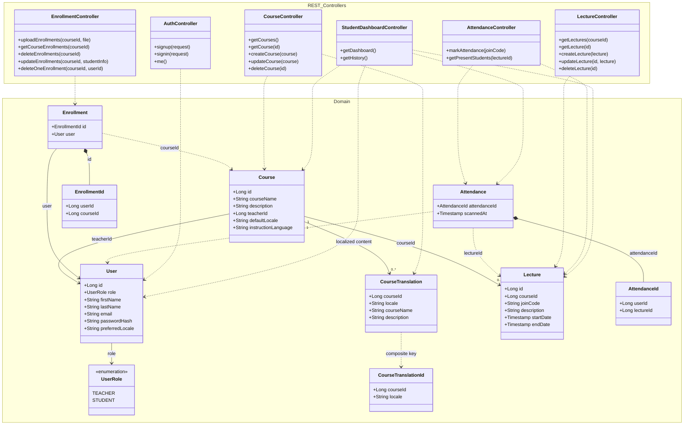

# Class Diagram

```mermaid
classDiagram
direction TB

namespace REST_Controllers {
  class StudentDashboardController {
    +getDashboard()
    +getHistory()
  }

  class AuthController {
    +signup(request)
    +signin(request)
    +me()
  }

  class CourseController {
    +getCourses()
    +getCourse(id)
    +createCourse(course)
    +updateCourse(course)
    +deleteCourse(id)
  }

  class LectureController {
    +getLectures(courseId)
    +getLecture(id)
    +createLecture(lecture)
    +updateLecture(id, lecture)
    +deleteLecture(id)
  }

  class EnrollmentController {
    +uploadEnrollments(courseId, file)
    +getCourseEnrollments(courseId)
    +deleteEnrollments(courseId)
    +updateEnrollments(courseId, studentInfo)
    +deleteOneEnrollment(courseId, userId)
  }

  class AttendanceController {
    +markAttendance(joinCode)
    +getPresentStudents(lectureId)
  }
}

namespace Domain {
  class User {
    +Long id
    +UserRole role
    +String firstName
    +String lastName
    +String email
    +String passwordHash
    +String preferredLocale
  }

  class UserRole {
    <<enumeration>>
    TEACHER
    STUDENT
  }

  class Course {
    +Long id
    +String courseName
    +String description
    +Long teacherId
    +String defaultLocale
    +String instructionLanguage
  }

  class CourseTranslation {
    +Long courseId
    +String locale
    +String courseName
    +String description
  }

  class CourseTranslationId {
    +Long courseId
    +String locale
  }

  class Lecture {
    +Long id
    +Long courseId
    +String joinCode
    +String description
    +Timestamp startDate
    +Timestamp endDate
  }

  class Enrollment {
    +EnrollmentId id
    +User user
  }

  class EnrollmentId {
    +Long userId
    +Long courseId
  }

  class Attendance {
    +AttendanceId attendanceId
    +Timestamp scannedAt
  }

  class AttendanceId {
    +Long userId
    +Long lectureId
  }
}

User --> UserRole : role
Course --> User : teacherId
Course "1" --> "0..*" Lecture : courseId
Course "1" --> "0..*" CourseTranslation : localized content
CourseTranslation ..> CourseTranslationId : composite key

Enrollment *-- EnrollmentId : id
Enrollment --> User : user
Enrollment ..> Course : courseId

Attendance *-- AttendanceId : attendanceId
Attendance ..> User : userId
Attendance ..> Lecture : lectureId

AuthController ..> User
CourseController ..> Course
CourseController ..> CourseTranslation
LectureController ..> Lecture
EnrollmentController ..> Enrollment
AttendanceController ..> Attendance
AttendanceController ..> Lecture
StudentDashboardController ..> User
StudentDashboardController ..> Course
StudentDashboardController ..> Lecture
StudentDashboardController ..> Attendance
```
