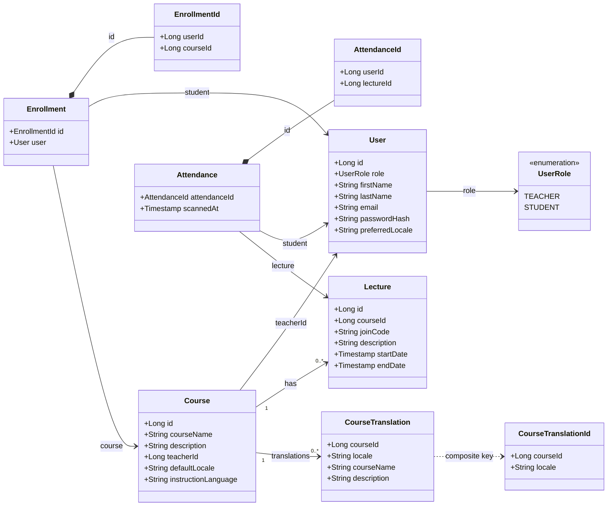
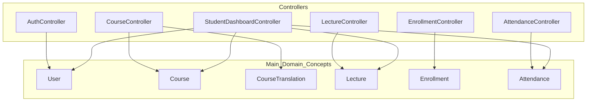

# Class Diagram

Reconstructed from [CLASS_DIAGRAM.pdf](/Users/levkaravanov/Dev/Attendance/docs/diagrams/CLASS_DIAGRAM.pdf) and aligned with the current backend code in [attendance-backend/src/main/java/org/example/attendancebackend](/Users/levkaravanov/Dev/Attendance/attendance-backend/src/main/java/org/example/attendancebackend).

## Domain Model

## REST Controllers Overview

## Notes

- `Course.courseName` and `Course.description` are resolved localized API values; the persisted localized text lives in `CourseTranslation`.
- Compared to the PDF version, this source includes the newer localization-related model changes: `CourseTranslation`, `CourseTranslationId`, `Course.defaultLocale`, `Course.instructionLanguage`, and `User.preferredLocale`.
- If you need a single diagram for the report, use the `Domain Model` block as the main class diagram and keep the controller block as a supporting figure.
