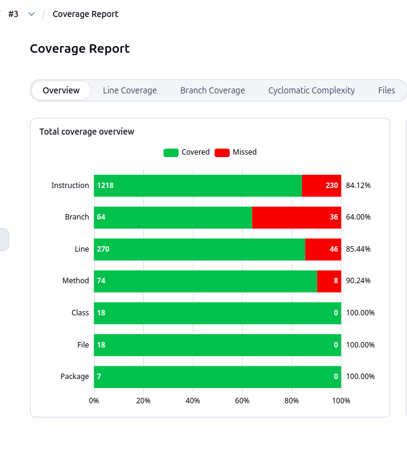
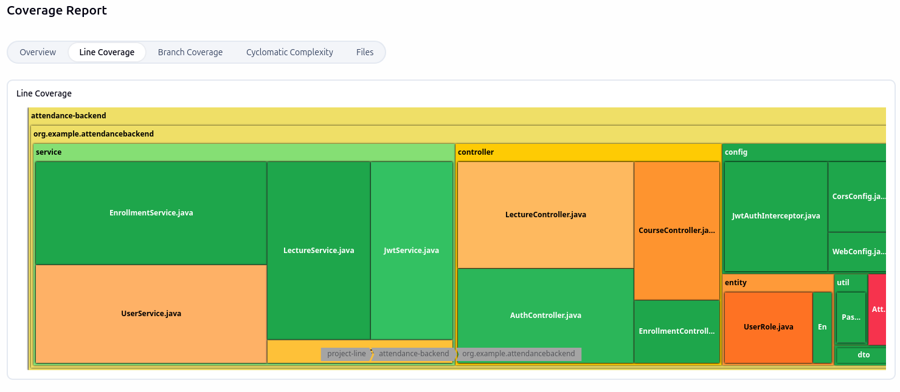

# Sprint 3 Review Report

**Sprint:** 3
**Date:** 11.02.2026 – 04.03.2026
**Team:** Soreen Oraibi, Lev Karavanov, Olga Shomarova, Viswak Ggautham, Alexey Lebedev

---

## Sprint Goal

- Finalize MVP functionality i.e the product is usable and works E2E.
- Implement Docker containerization layer
- Implement Jenkins CI/CD pipeline

---

## Completed Tasks

| ID | Task                                                                          | Status |
|----|-------------------------------------------------------------------------------|------|
| 1  | Design and implement database schema (PostgreSQL + H2 for tests)              | Done |
| 2  | Create the initial setup for the project                                      | Done |
| 3  | Design UI with Figma                                                          | Done |
| 4  | Design common frontend components with mui                                    | Done |
| 5  | Implement backend endpoint `POST /signup` for user registration               | Done |
| 6  | Add reusable password hashing utility                                         | Done |
| 7  | Add JUnit tests for signup edge cases                                         | Done |
| 8  | Implement backend endpoint `POST /signin` for user login                      | Done |
| 9  | Add JUnit tests for signin                                                    | Done |
| 10 | Implement Course entity, repository, service, and controller and tests for them | Done |
| 11 | Create login page                                                             | Done |
| 12 | Implement Lecture entity and CRUD endpoints                                   | Done |
| 13 | Create signup page                                                            | Done |
| 14 | Create rabbit integration                                                     | Done |

---

## Demo Summary

- Demonstrated the most important features of the application working end-to-end
- Demonstrated working Jenkins pipeline
- Demonstrated working Docker containerization layer

---

## What Went Well

- Sprint objectives were fully met due to active internal collaboration and communication.
- The team was able to efficiently diversify the workforce which enabled delivery of heterogeneous tasks.

---

## Test Coverage

  

---

*Report prepared: 02.03.2026*
