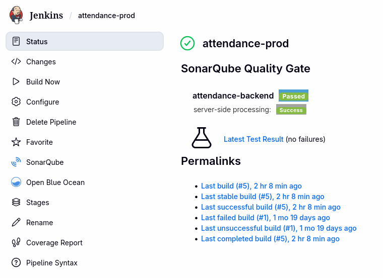
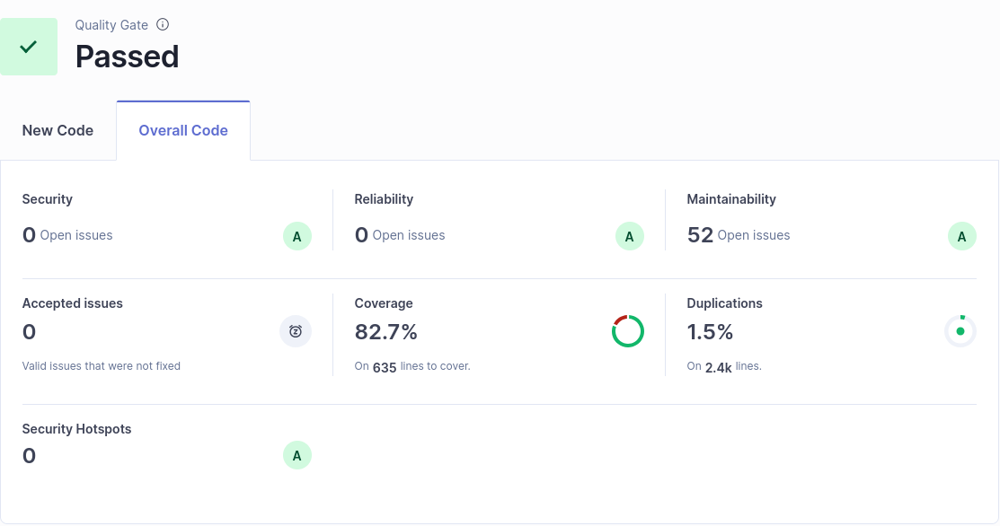

# Sprint 7 Review Report

**Sprint:** 7  
**Theme (course):** Project Testing, Functional and non-functional Testing
**Period:** 16.04.2026 – 30.04.2026.  
**Team:** Soreen Oraibi (SeoBlack), Lev Karavanov (levkaravanov), Olga Shomarova (olshom), Viswak Ggautham (viswak-DataCrunch), Alexey Lebedev (zalman29096)

---

Our functional testing and refactoring were based on issues reported by SonarQube.

| Issue                | Resolution                                                     |
|----------------------|----------------------------------------------------------------|
| Missing DTO usage    | Create DTO for lecture and course                              |
| SOP issue            | Add logger                                                     |
| Random in the method | Create private static final `SecureRandom RANDOM` in the class |
| Low test coverage    | Add tests for services                                         |

After resolving these issues, we added a SonarQube stage to the Jenkins pipeline.

---

## 12 Heuristic Issues for the Project

| No | Heuristic                                     | Issue                                                                                                                                              | Severity (0-4) | Suggested Improvement                                                                                               |
|----|-----------------------------------------------|----------------------------------------------------------------------------------------------------------------------------------------------------|----------------|---------------------------------------------------------------------------------------------------------------------|
| 1  | H1-1: Simple & natural dialog                 | Several visible controls are non-functional or placeholder-only (e.g., dead links/buttons, placeholder attendance page), which reduces user trust. | 4              | Remove unfinished controls from UI or fully implement them before exposure; avoid placeholder routes in production. |
| 2  | H1-2: Speak the users' language               | Some error messages remain technical or English-only in localized flows.                                                                           | 3              | Move all errors to translation files and show user-friendly wording with clear next actions.                        |
| 3  | H1-3: Minimize users' memory load             | Teachers/students must remember context (active lecture code, large unfiltered attendance history, icon meanings).                                 | 3              | Add active/inactive lecture status, filters/search/sort for history, and clearer labels/tooltips for actions.       |
| 4  | H1-4: Consistency                             | UI patterns are inconsistent across pages (native confirms vs MUI dialogs, different loading-state styles, mixed naming).                          | 2              | Standardize confirmation dialogs, loading/empty states, and attendance terminology across all pages.                |
| 5  | H1-5: Feedback                                | Resource creation and live attendance states are not always explicitly confirmed (missing success notifications/counters).                         | 2              | Add success toasts/snackbars and real-time counter updates for marked/unmarked/present/absent values.               |
| 6  | H1-6: Clearly marked exits                    | Some pages lack clear return/escape routes (e.g., sign-up back-to-login, lecture dashboard back action).                                           | 2              | Add explicit Back and Already have an account? Sign in links/buttons where appropriate.                             |
| 7  | H1-7: Shortcuts                               | Frequent teacher actions require deep navigation (e.g., starting a lecture via courses table only).                                                | 2              | Add dashboard quick actions: Create course, Start lecture, Upload enrollments, View active lectures.                |
| 8  | H1-8: Precise & constructive error messages   | Generic unknown error responses do not explain cause or recovery path.                                                                             | 3              | Map common HTTP/network cases to specific guidance (retry, credentials check, sign in instead, contact support).    |
| 9  | H1-9: Prevent errors                          | Validation is weak or late in some flows (email/password rules not shown early, enrollment input quality issues, file-type surprises).             | 4              | Add client-side validation/helper text, pre-submit constraints, accepted file format hints, and safer input checks. |
| 10 | H1-10: Help & documentation                   | No clear in-app help/FAQ/onboarding and no robust recovery path for forgotten-password/new users.                                                  | 3              | Add Help/FAQ page, first-login guided tour, contextual hints, and complete password reset flow.                     |
| 11 | H1-5: Feedback (live session)                 | Lecture dashboard summary metrics can conflict with list data or show placeholders during live tracking.                                           | 3              | Bind dashboard summary cards to the same attendance data source and refresh periodically.                           |
| 12 | H1-2/H1-3: Language & recognition over recall | Icon-only actions (edit/delete/start/enroll) are not always self-explanatory and can be misinterpreted.                                            | 2              | Add text labels or consistent tooltips; where possible, use named action columns to reduce cognitive load.          |

---

## Test Environment

| Item     | Value                              |
|----------|------------------------------------|
| Frontend | `attendance-frontend` latest build |
| Backend  | `attendancebackend` latest build   |
| Database | UTF-8 enabled, latest schema       |
| Accounts | 1 teacher + 1 student              |

## Acceptance Test Cases (Baseline)

| ID    | Scenario                                                 | Expected Result                            |
|-------|----------------------------------------------------------|--------------------------------------------|
| TC-01 | Sign in as teacher and student, verify role-based access | Each role sees only allowed pages/actions  |
| TC-02 | Create a course and lecture as teacher                   | Course and lecture are created and visible |
| TC-03 | Mark attendance as student using lecture code            | Attendance is saved successfully           |
| TC-04 | Open attendance pages and verify shown data              | Data is correct and consistent             |
| TC-05 | Create course in English                                 | English translation row is stored          |
| TC-06 | Add same course in Russian                               | Russian version is retrievable             |
| TC-07 | Request course with missing locale                       | System returns default locale content      |
| TC-08 | Save/retrieve Arabic or Cyrillic text                    | Text is preserved correctly (UTF-8)        |
| TC-09 | Teacher uploads student list                             | Students are imported to the course        |
| TC-10 | Teacher adds one student manually                        | Student appears in course enrollment list  |

## Team Consolidated Results

| Test Case | Soreen Oraibi | Lev Karavanov | Olga Shomarova | Viswak Ggautham |
|-----------|---------------|---------------|----------------|-----------------|
| TC-01     | PASS          | PASS          | PASS           | PASS            |
| TC-02     | PASS          | PASS          | PASS           | PASS            |
| TC-03     | PASS          | PASS          | PASS           | PASS            |
| TC-04     | PASS          | PASS          | PASS           | PASS            |
| TC-05     | PASS          | PASS          | PASS           | PASS            |
| TC-06     | PASS          | PASS          | PASS           | PASS            |
| TC-07     | PASS          | PASS          | PASS           | PASS            |
| TC-08     | PASS          | PASS          | PASS           | PASS            |
| TC-09     | PASS          | PASS          | PASS           | PASS            |
| TC-10     | PASS          | PASS          | PASS           | PASS            |

**Overall result:**

- All tests passed for all engineers.

## Team Contribution

| Team Member Name                    | Assigned Tasks (Summary)     | Time Spent (hrs) |
|-------------------------------------|------------------------------|------------------|
| Soreen Oraibi (SeoBlack)            | UAT and heuristic evaluation | 4 h              |
| Lev Karavanov (levkaravanov)        | UAT and heuristic evaluation | 4 h              |
| Olga Shomarova (olshom) [Master]    | UAT and heuristic evaluation | 5 h              |
| Viswak Ggautham (viswak-DataCrunch) | UAT and heuristic evaluation | 4 h              |
| Alexey Lebedev (zalman29096)        | UAT and heuristic evaluation | 3 h              |
